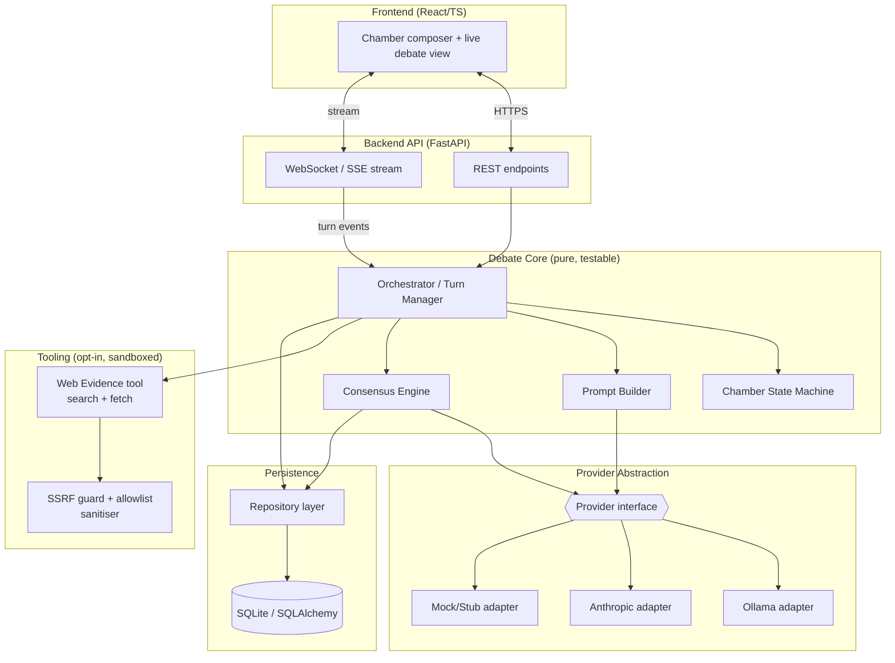
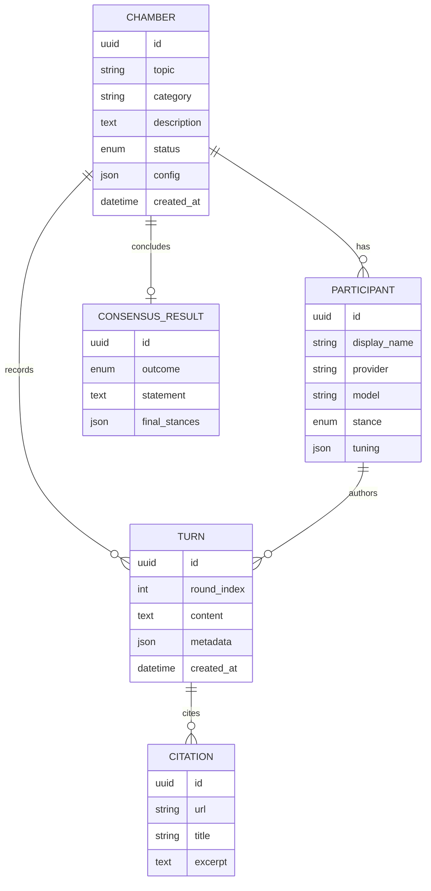
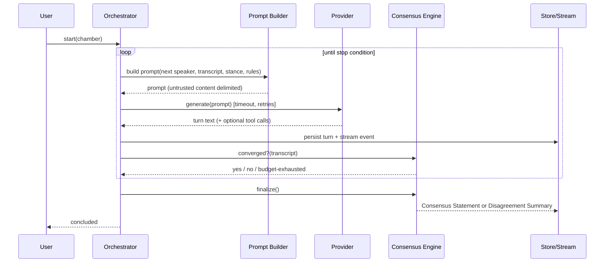

# Cicero — Architecture

> **Status:** **Approved v1.0** (2026-07-16).
> This document describes *how* Cicero is built to satisfy
> [`requirements.md`](./requirements.md). Approved decisions are recorded in §10.

---

## 1. Architectural drivers (what shapes the design)
1. **Provider-agnostic debates** — swap Ollama / Anthropic / future providers
   behind one interface (FR-10, NFR-M-1).
2. **Turn-based orchestration with live streaming** — a long-running loop whose
   output must stream to observers (FR-14/18).
3. **Security-first, public repo** — no secrets, sandboxed web access,
   injection resistance (NFR-SEC-*).
4. **Deeply testable core** — deterministic engine, mock providers, mutation
   testing (NFR-Q-*).
5. **Self-hosted / single-user first**, but structured to grow.

## 2. Recommended technology stack

| Layer | Recommendation | Why |
|---|---|---|
| **Backend language** | **Python 3.12** | Best-in-class LLM ecosystem; first-class Ollama & Anthropic SDKs; strong mutation-testing tooling (`mutmut`/`cosmic-ray`); async support. |
| **API framework** | **FastAPI** + Uvicorn | Async, typed (Pydantic) request/response, built-in OpenAPI, native WebSocket/SSE for live streaming. |
| **Data validation** | **Pydantic v2** | Shared models across API, engine, persistence; strong input validation (NFR-SEC-6). |
| **Persistence** | **SQLite** (default) via **SQLAlchemy 2.0** + **Alembic** migrations | Zero-setup local default; swap to Postgres via config with no code change. |
| **Async LLM calls** | **`httpx`** for both Ollama and Anthropic (Messages API) | One async HTTP dependency; injectable client makes providers hermetically testable via `httpx.MockTransport` (no network in CI). The Anthropic SDK can replace the adapter later without touching the engine. |
| **Frontend** | **React + TypeScript + Vite** | Live transcript streaming, componentised UI; strong mutation testing via **StrykerJS**. |
| **Mutation testing** | **`mutmut`** (Python core) + **StrykerJS** (frontend) | Enforced quality gate on core logic (NFR-Q-2). |
| **Unit/integration tests** | **pytest** (+ `pytest-asyncio`), **Vitest** (frontend) | Deterministic, provider-mocked. |
| **Lint / type / format** | **ruff**, **mypy**, (frontend) **eslint** + **tsc** | CI quality gate (NFR-Q-4). |
| **Packaging / run** | **Docker + Compose** (optional), `uv`/`pip` for deps | Reproducible local runs (NFR-O). |
| **CI** | **GitHub Actions** | Lint, type, test, mutation, secret scan, SCA. |

**Rationale for Python backend + React frontend:** the debate engine, provider
adapters, and security-sensitive logic (the parts that most need mutation
testing) live in Python where the LLM tooling is strongest; the UI is a thin,
replaceable client over a clean API. This keeps the risky/valuable logic in one
well-tested core. *(Alternative stacks are offered for approval in §10 / the
chat summary.)*

## 3. Component architecture



### 3.1 Component responsibilities
- **Orchestrator / Turn Manager** — owns the debate loop: selects next speaker,
  assembles context, invokes the provider, records the turn, checks stop
  conditions, emits stream events. Pure logic; providers/clock/store injected
  (fully mockable → high mutation coverage).
- **Prompt Builder** — deterministic construction of each turn's prompt from
  topic, stance, persona, transcript window, and rules. **Enforces delimiting**
  of untrusted content (other turns, web excerpts) — central to injection
  defence (NFR-SEC-5).
- **Consensus Engine** — hybrid detector (see §6). Produces Consensus Statement
  or Disagreement Summary.
- **Chamber State Machine** — validates lifecycle transitions (FR-4).
- **Provider abstraction** — one interface; Ollama/Anthropic/Mock adapters.
- **Web Evidence tool** — optional; wrapped by the **SSRF guard + sanitiser**.
- **Repository layer** — persistence boundary; the core depends on interfaces,
  not SQLAlchemy.

### 3.2 Layering & dependency rule
```
UI  →  API  →  Debate Core  →  (Provider interface, Repository interface, Tool interface)
                                   ↑ adapters implement these (Ollama, Anthropic, SQLite, Web)
```
The **core has no dependency on frameworks or I/O** — it talks to interfaces
only. This is what makes it deterministic and mutation-testable, and keeps
providers/DB/UI swappable (NFR-M-3).

## 4. Key domain model


Secrets (API keys) are **never** stored on entities — they live only in runtime
config/env (NFR-SEC-1/3).

## 5. Debate loop (runtime)


Stop conditions (FR-16): `max_rounds` ∨ `token/time budget` ∨ `consensus` —
whichever first. Budgets are hard caps (NFR-SEC-8) preventing runaway loops/cost.

## 6. Consensus mechanism (addresses OQ-1)
**Recommended: hybrid.**
1. **Signal (cheap, deterministic):** after each round, capture each
   participant's self-reported stance + confidence via a structured micro-prompt;
   track **stance stability** across rounds.
2. **Adjudication (LLM moderator):** when stances stabilise (or budget nears), a
   **moderator role** assesses whether a genuine common position exists and, if
   so, drafts the Consensus Statement; participants get a final ratification turn
   (endorse / object).
3. **Fallback:** if no convergence within budget → **Disagreement Summary**
   (positions, key cruxes, unresolved points) (FR-24).

This avoids naive "everyone said yes" sycophancy by recording *final stances and
objections explicitly* (FR-23/25) and by separating detection (rule-based) from
synthesis (LLM). The moderator can be any configured provider.

## 7. Security architecture (NFR-SEC-*)
- **Secrets:** env-only (`ANTHROPIC_API_KEY`, etc.); `.env`, `*.local`, secret
  files git-ignored; loaded via settings object; **never** logged, serialised to
  API responses, or sent to the frontend. CI **secret scanning** blocks leaks.
- **Web/tool sandbox (SSRF guard):** resolve target host, **reject** private,
  loopback, link-local, and cloud-metadata IP ranges (e.g. 169.254.169.254);
  **allowlist** of permitted domains/schemes (https only); per-request
  **timeout**, **max response size**, and **MIME allowlist**; redirects
  re-validated. Off by default, per-chamber opt-in (FR-27).
- **Prompt-injection defence:** all untrusted text (other participants' output
  used as context, fetched web content) is wrapped in explicit,
  non-executable delimiters; system rules state that content inside data
  delimiters is *information, not instructions*; the orchestrator/moderator never
  executes embedded commands (NFR-SEC-5).
- **Input validation / output encoding:** Pydantic validates all inputs;
  transcripts are rendered as **text (escaped)** in the UI — never as raw
  HTML — to prevent XSS from model/web content (NFR-SEC-6).
- **Transport/exposure:** localhost binding by default; security headers + strict
  CORS; optional authn/authz gate required before any non-local deployment
  (NFR-SEC-9). Rate limits + budgets (NFR-SEC-8).
- **Supply chain:** pinned deps; CI dependency (SCA) scanning; minimal runtime
  image; least privilege (NFR-SEC-7).
- **Docs:** `SECURITY.md` (responsible disclosure) + threat model (STRIDE-lite)
  maintained (NFR-SEC-10).

See [`security.md`](./security.md) for the full threat model.

## 8. Testing & mutation-testing strategy (NFR-Q-2)
- **Unit/integration:** pytest with **all providers mocked** — no live LLM or
  network calls in CI; deterministic fixtures/seeds (NFR-Q-1/3).
- **Mutation testing:** `mutmut` targets the **debate core** (orchestrator,
  prompt builder, consensus engine, state machine, SSRF guard) — the highest-risk
  logic. A **minimum mutation score** is enforced in CI; surviving mutants are
  triaged (kill or justify). Frontend logic uses **StrykerJS**.
- **Security tests:** explicit cases for SSRF rejection, injection delimiting,
  and secret non-leakage.
- Details in [`testing.md`](./testing.md).

## 9. Proposed repository layout
```
cicero/
├── docs/                  # requirements, backlog, architecture, testing, security
├── backend/
│   ├── cicero/
│   │   ├── core/          # orchestrator, prompt builder, consensus, state machine (pure)
│   │   ├── providers/     # interface + ollama, anthropic, mock adapters
│   │   ├── tools/         # web evidence + ssrf guard (opt-in)
│   │   ├── persistence/   # repository interfaces + sqlalchemy impl + migrations
│   │   ├── api/           # FastAPI routers, schemas, streaming
│   │   └── config.py      # env-based settings (secrets)
│   └── tests/             # unit, integration, security, mutation config
├── frontend/              # React + TS + Vite (added at Milestone 2)
├── .github/workflows/     # CI: lint, type, test, mutation, secret-scan, SCA
├── SECURITY.md
├── CONTRIBUTING.md
├── .gitignore / .env.example
└── docker-compose.yml     # optional
```

## 10. Approved decisions (2026-07-16)
- **D-1 Stack:** ✅ **Python 3.12 / FastAPI backend + React/TypeScript frontend.**
- **D-2 Consensus:** ✅ **Hybrid** — deterministic stance-stability signal + LLM
  moderator synthesis + participant ratification, with a Disagreement Summary
  fallback (see §6).
- **D-3 Web evidence (Epic G):** ✅ **Full feature in v1.** Working web
  search + fetch with citations is in scope for the first release, built behind
  the SSRF-sandbox from the start (§7). Off by default, per-chamber opt-in.
- **D-4 Persistence:** ✅ **SQLite default** via SQLAlchemy; Postgres via config
  later.
- **D-5 UI depth:** ✅ **Lightweight web UI** — compose a chamber, add
  participants, watch the debate stream live, view/export the result.

Implementation proceeds per the (revised) milestones in
[`backlog.md`](./backlog.md), starting with Milestone 0 — Foundation & Security
baseline.
