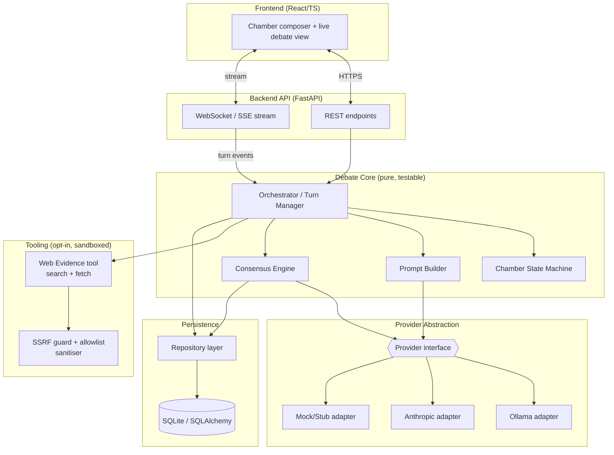
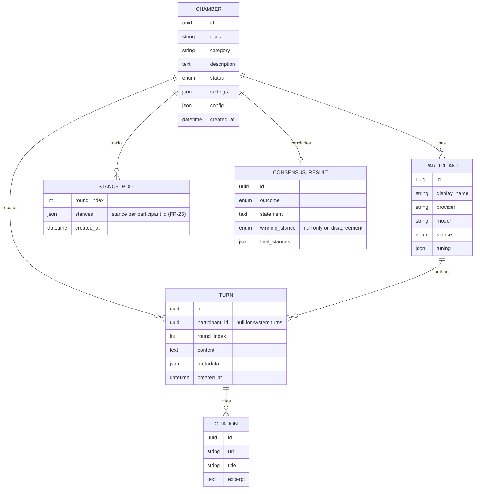
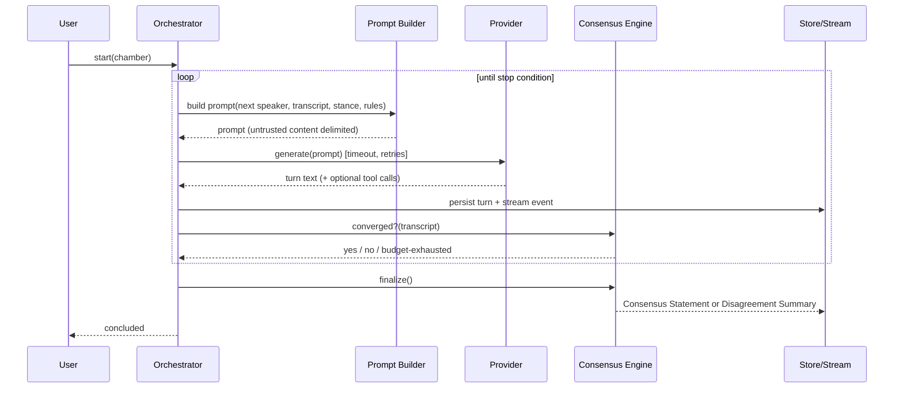

# Cicero — Architecture

> **Status:** **Approved v1.0** (2026-07-16).
> This document describes *how* Cicero is built to satisfy
> [`requirements.md`](./requirements.md). Approved decisions are recorded in §10.

---

## 1. Architectural drivers (what shapes the design)
1. **Provider-agnostic debates** — swap Ollama / Anthropic / future providers
   behind one interface (FR-10, NFR-M-1).
2. **Turn-based orchestration with live streaming** — a long-running loop whose
   output must stream to observers (FR-14/18).
3. **Security-first, public repo** — no secrets, sandboxed web access,
   injection resistance (NFR-SEC-*).
4. **Deeply testable core** — deterministic engine, mock providers, mutation
   testing (NFR-Q-*).
5. **Self-hosted / single-user first**, but structured to grow.

## 2. Recommended technology stack

| Layer | Recommendation | Why |
|---|---|---|
| **Backend language** | **Python 3.11+** (CI pins 3.11) | Best-in-class LLM ecosystem; first-class Ollama & Anthropic SDKs; strong mutation-testing tooling (`mutmut`/`cosmic-ray`); async support. |
| **API framework** | **FastAPI** + Uvicorn | Async, typed (Pydantic) request/response, built-in OpenAPI, native WebSocket/SSE for live streaming. |
| **Data validation** | **Pydantic v2** | Shared models across API, engine, persistence; strong input validation (NFR-SEC-6). |
| **Persistence** | **SQLite** (default) via **SQLAlchemy 2.0** | Zero-setup local default; swap to Postgres via config with no code change. The schema is currently created on first use (`metadata.create_all`); a migration tool (Alembic) lands when the first backward-incompatible schema change does. |
| **Async LLM calls** | **`httpx`** for both Ollama and Anthropic (Messages API) | One async HTTP dependency; injectable client makes providers hermetically testable via `httpx.MockTransport` (no network in CI). The Anthropic SDK can replace the adapter later without touching the engine. |
| **Frontend** | **React + TypeScript + Vite** | Live transcript streaming, componentised UI; strong mutation testing via **StrykerJS**. |
| **Mutation testing** | **`mutmut`** (Python core) + **StrykerJS** (frontend) | Enforced quality gate on core logic (NFR-Q-2). |
| **Unit/integration tests** | **pytest** (+ `pytest-asyncio`), **Vitest** (frontend) | Deterministic, provider-mocked. |
| **Lint / type / format** | **ruff**, **mypy**, (frontend) **eslint** + **tsc** | CI quality gate (NFR-Q-4). |
| **Packaging / run** | **Docker + Compose** (optional), `uv`/`pip` for deps | Reproducible local runs (NFR-O). |
| **CI** | **GitHub Actions** | Lint, type, test, mutation, secret scan, SCA. |

**Rationale for Python backend + React frontend:** the debate engine, provider
adapters, and security-sensitive logic (the parts that most need mutation
testing) live in Python where the LLM tooling is strongest; the UI is a thin,
replaceable client over a clean API. This keeps the risky/valuable logic in one
well-tested core. *(Alternative stacks are offered for approval in §10 / the
chat summary.)*

## 3. Component architecture



### 3.1 Component responsibilities
- **Orchestrator / Turn Manager** — owns the debate loop: selects next speaker,
  assembles context, invokes the provider, records the turn, checks stop
  conditions, emits stream events. Pure logic; providers/clock/store injected
  (fully mockable → high mutation coverage).
- **Prompt Builder** — deterministic construction of each turn's prompt from
  topic, stance, persona, transcript window, and rules. **Enforces delimiting**
  of untrusted content (other turns, web excerpts) — central to injection
  defence (NFR-SEC-5).
- **Consensus Engine** — hybrid detector (see §6). Produces Consensus Statement
  or Disagreement Summary.
- **Chamber State Machine** — validates lifecycle transitions (FR-4).
- **Provider abstraction** — one interface; Ollama/Anthropic/Mock adapters.
- **Web Evidence tool** — optional; wrapped by the **SSRF guard + sanitiser**.
- **Repository layer** — persistence boundary; the core depends on interfaces,
  not SQLAlchemy.

### 3.2 Layering & dependency rule
```
UI  →  API  →  Debate Core  →  (Provider interface, Repository interface, Tool interface)
                                   ↑ adapters implement these (Ollama, Anthropic, SQLite, Web)
```
The **core has no dependency on frameworks or I/O** — it talks to interfaces
only. This is what makes it deterministic and mutation-testable, and keeps
providers/DB/UI swappable (NFR-M-3).

## 4. Key domain model


`CHAMBER.settings` holds the per-chamber debate tuning (round/token/time budgets,
`min_rounds`, `convergence_rounds`, `decision_rule`, `web_evidence`);
`CHAMBER.config` holds the *outcome* of a run (`stop_reason`, `rounds_completed`,
`tokens_used`). A `TURN` with a null `participant_id` is system-authored — a
moderator note or an evidence brief — distinguished by `metadata["kind"]`.

Secrets (API keys) are **never** stored on entities — they live only in runtime
config/env (NFR-SEC-1/3).

## 5. Debate loop (runtime)


Stop conditions (FR-16): `max_rounds` ∨ `token/time budget` ∨ `consensus` —
whichever first. Budgets are hard caps (NFR-SEC-8) preventing runaway loops/cost.

## 6. Consensus mechanism (addresses OQ-1) — implemented (Milestone 3)
**Hybrid detection + a decision rule, run in two debate phases.**

1. **Two phases (why debates now converge).** Assigned stances are framed as
   *starting positions* for honest, truth-seeking debaters — not roles to
   defend at all costs. The last `settings.convergence_rounds` rounds switch
   the prompts into a **convergence phase**: stop opening new attacks, concede
   what is well argued, name the strongest position, propose a workable
   compromise. If stances stabilise early in the adversarial phase, the engine
   fast-forwards straight into the convergence phase rather than burning
   rounds on a stalemate.
2. **Signal (cheap, deterministic):** after each round, each participant's
   stance is polled with a one-word micro-prompt that explicitly permits
   changing sides; stability across rounds is tracked.
3. **Decision rule (`settings.decision_rule`)** resolves the final poll:
   - `unanimous` — only full agreement counts (else Disagreement Summary).
   - `majority` — the plurality of final stances wins (tie → disagreement).
   - `judge` *(default)* — like majority, but on a tie the moderator weighs
     the arguments and **declares a winner** (`WINNER: pro|con|neutral` +
     verdict). Under this rule a debate always ends with one position on top.
4. **Adjudication (LLM moderator):** drafts the terminal artifact matching the
   outcome — Consensus Statement, majority Resolution, judge's Verdict, or
   Summary of Disagreement (FR-23/24). The winning stance is recorded on the
   `ConsensusResult` (`winning_stance`).

This avoids naive "everyone said yes" sycophancy by recording *final stances and
objections explicitly* (FR-23/25) and by separating detection (rule-based) from
synthesis (LLM). The moderator can be any configured provider.

## 7. Security architecture (NFR-SEC-*)
- **Secrets:** env-only (`ANTHROPIC_API_KEY`, etc.); `.env`, `*.local`, secret
  files git-ignored; loaded via settings object; **never** logged, serialised to
  API responses, or sent to the frontend. CI **secret scanning** blocks leaks.
- **Web/tool sandbox (SSRF guard):** resolve target host, **reject** private,
  loopback, link-local, and cloud-metadata IP ranges (e.g. 169.254.169.254);
  **allowlist** of permitted domains/schemes (https only); per-request
  **timeout**, **max response size**, and **MIME allowlist**; redirects
  re-validated. Off by default, per-chamber opt-in (FR-27).
- **Prompt-injection defence:** all untrusted text (other participants' output
  used as context, fetched web content) is wrapped in explicit,
  non-executable delimiters; system rules state that content inside data
  delimiters is *information, not instructions*; the orchestrator/moderator never
  executes embedded commands (NFR-SEC-5).
- **Input validation / output encoding:** Pydantic validates all inputs;
  transcripts are rendered as **text (escaped)** in the UI — never as raw
  HTML — to prevent XSS from model/web content (NFR-SEC-6).
- **Transport/exposure:** localhost binding by default; security headers + strict
  CORS; optional authn/authz gate required before any non-local deployment
  (NFR-SEC-9). Rate limits + budgets (NFR-SEC-8).
- **Supply chain:** pinned deps; CI dependency (SCA) scanning; minimal runtime
  image; least privilege (NFR-SEC-7).
- **Docs:** `SECURITY.md` (responsible disclosure) + threat model (STRIDE-lite)
  maintained (NFR-SEC-10).

See [`security.md`](./security.md) for the full threat model.

## 8. Testing & mutation-testing strategy (NFR-Q-2)
- **Unit/integration:** pytest with **all providers mocked** — no live LLM or
  network calls in CI; deterministic fixtures/seeds (NFR-Q-1/3).
- **Mutation testing:** `mutmut` targets the **debate core** (orchestrator,
  prompt builder, consensus engine, state machine, SSRF guard) — the highest-risk
  logic. A **minimum mutation score** is enforced in CI; surviving mutants are
  triaged (kill or justify). Frontend logic uses **StrykerJS**.
- **Security tests:** explicit cases for SSRF rejection, injection delimiting,
  and secret non-leakage.
- Details in [`testing.md`](./testing.md).

## 9. Repository layout (as built)
```
cicero/
├── docs/                  # requirements, backlog, architecture, testing, security
├── backend/
│   ├── cicero/
│   │   ├── core/          # pure debate logic: orchestrator, prompt_builder, prompts,
│   │   │                  #   consensus, state_machine, budget, research, recovery,
│   │   │                  #   metrics, export, compare
│   │   ├── providers/     # interface + ollama, anthropic, mock adapters + factory
│   │   ├── tools/         # web evidence + SSRF guard (opt-in)
│   │   ├── persistence/   # repository interface + in-memory and SQLAlchemy impls
│   │   ├── api/           # FastAPI app, routers, schemas, SSE events, debate manager,
│   │   │                  #   rate limiting, dependency wiring
│   │   └── config.py      # env-based settings (secrets)
│   ├── scripts/           # check_mutation_score.py (quality gate), demo.py (J4 demo)
│   ├── tests/             # unit, integration, security, e2e demo; mutation config
│   └── Dockerfile         # API image (non-root, no baked secrets)
├── frontend/              # React + TS + Vite (added at Milestone 2)
│   ├── Dockerfile         # build → nginx static serve
│   └── nginx.conf         # serves the SPA, reverse-proxies the API same-origin
├── docker-compose.yml     # self-hosted stack, localhost-published (A6)
├── .github/workflows/     # CI: lint, type, test, demo, mutation, secret-scan, SCA
├── SECURITY.md
├── CONTRIBUTING.md
└── .gitignore / .dockerignore / .env.example
```

**Containerised runs (A6 / NFR-O-2).** `docker compose up --build` serves the UI
on `http://localhost:8080` with the API behind it. Three deliberate choices:

- **nginx reverse-proxies the API** (`/chambers`, `/providers`, `/health`,
  `/config`) to the backend service, so the SPA is same-origin end to end — no
  CORS, and `EventSource` streams without cross-origin configuration. Buffering
  is off and the read timeout is long, because SSE must flow as it is produced
  (FR-18). That proxy list is the deployed twin of the dev-server proxy in
  `vite.config.ts` and the two must be kept in step.
- **Both ports publish to `127.0.0.1` only**, matching the API's localhost
  default (NFR-SEC-9). Exposing the stack to a network is a deliberate edit, and
  should come with `API_AUTH_TOKEN`.
- **No secrets in any image.** The API image runs as a non-root user and reads
  everything from the environment at run time; compose interpolates from a
  git-ignored root `.env` (NFR-SEC-1/3). The backend build context is the
  repository root because `backend/pyproject.toml` declares
  `readme = "../README.md"`; the root `.dockerignore` keeps the rest out.

CI builds and smoke-tests this stack on every push (the `docker` job): it starts
it with `--wait`, checks `/health` and the served UI, creates and reads back a
chamber *through the nginx proxy*, probes `/config`, and asserts the API
container is not running as root. So the container path is covered by the same
gate as the code, rather than resting on someone having tried it once.

That job earned its place immediately: the first run failed with `401` on
`POST /chambers` while `/health` passed. `API_AUTH_TOKEN: ${API_AUTH_TOKEN:-}`
injects an **empty string** when the variable is unset, and an empty secret is
not `None` — so authentication switched on with a token no caller could ever
send, and every endpoint but `/health` was unreachable. Fixed on both sides:
`Settings` now treats a blank secret as unset (a `.env` written from
`.env.example`, which ships `ANTHROPIC_API_KEY=`, hits exactly the same trap),
and compose passes the optional secrets through by name so an unset variable is
never injected at all.

## 10. Approved decisions (2026-07-16)
- **D-1 Stack:** ✅ **Python (3.11+) / FastAPI backend + React/TypeScript frontend.**
- **D-2 Consensus:** ✅ **Hybrid** — deterministic stance-stability signal + LLM
  moderator synthesis + participant ratification, with a Disagreement Summary
  fallback (see §6).
- **D-3 Web evidence (Epic G):** ✅ **Full feature in v1.** Working web
  search + fetch with citations is in scope for the first release, built behind
  the SSRF-sandbox from the start (§7). Off by default, per-chamber opt-in.
- **D-4 Persistence:** ✅ **SQLite default** via SQLAlchemy; Postgres via config
  later.
- **D-5 UI depth:** ✅ **Lightweight web UI** — compose a chamber, add
  participants, watch the debate stream live, view/export the result.

Implementation proceeds per the (revised) milestones in
[`backlog.md`](./backlog.md), starting with Milestone 0 — Foundation & Security
baseline.

## 11. Live streaming & the web UI (Milestone 2)

The synchronous `run` of Milestone 1 is complemented by a background execution +
streaming path:

- **`api/debate_manager.py`** runs a debate as an asyncio task. The engine's
  injected `TurnListener` hook publishes each turn — plus status, consensus,
  error, and done events — to a per-chamber pub/sub. Events are retained so a
  client that connects mid-debate replays what it missed.
- **`api/events.py`** defines the event model and its **Server-Sent Events**
  (SSE) wire format.
- The API exposes:

  | Endpoint | Purpose |
  |---|---|
  | `POST/GET/DELETE /chambers[/{id}]` | Chamber CRUD (FR-1/2) |
  | `PATCH /chambers/{id}` | Edit topic/category/description while `draft` (FR-3) |
  | `PUT /chambers/{id}/settings` | Debate tuning while `draft` (FR-11/16) |
  | `POST /chambers/{id}/participants` | Add a debater (FR-6/7) |
  | `PATCH /chambers/{id}/participants/{pid}` | Edit a debater while `draft` (FR-3) |
  | `DELETE /chambers/{id}/participants/{pid}` | Remove a debater while `draft` (FR-3) |
  | `POST /chambers/{id}/participants/{pid}/mute` | Mute/unmute, incl. mid-debate (FR-13) |
  | `POST /chambers/{id}/run` | Start — async → 202, or `?wait=true` (FR-19) |
  | `POST /chambers/{id}/step` | Run one turn, then park as `paused` (FR-19) |
  | `POST /chambers/{id}/resume` | Continue a paused debate (FR-19, J3) |
  | `POST /chambers/{id}/stop` | Park a running debate as `paused` (FR-19) |
  | `GET /chambers/{id}/events` | SSE stream of turns/status/consensus (FR-18) |
  | `POST /chambers/{id}/notes` | Moderator note between turns (FR-21) |
  | `POST /chambers/{id}/clone` | Draft copy for a rerun (FR-5) |
  | `GET /chambers/{a}/compare/{b}` | Run-vs-run comparison (FR-32) |
  | `GET /chambers/{id}/export?format=json\|markdown` | Export (FR-31) |
  | `GET /chambers/{id}/metrics` | Per-participant token/turn/error counts (FR-33) |
  | `GET /providers`, `GET /providers/{p}/models` | Provider + model discovery (FR-12) |
  | `GET /health`, `GET /config` | Liveness and non-secret capability flags |
- **Frontend** (`frontend/`, React + TypeScript + Vite): a lightweight SPA whose
  `EventSource` consumes the SSE stream. Model/transcript text is rendered as
  React text nodes (auto-escaped) — no `innerHTML` of untrusted content, so
  model/web output cannot inject scripts (NFR-SEC-6, I4). Pure presentation logic
  (`src/format.ts`) and the API client (`src/api.ts`) are unit-tested (Vitest)
  and are the frontend mutation-testing targets.

SSE (one-directional server→client) is chosen over WebSockets because debate
streaming is a pure fan-out of events; there is no client→server channel to
justify a bidirectional socket.

**Draft mutability (FR-3).** Everything that defines *what will be debated* —
topic, category, description, debate settings, and the participant roster — is
editable only while the chamber is `draft`, enforced in one place
(`_require_draft`) so every write path answers `409` identically once a debate
has started. The rule keeps a transcript honest: a concluded debate always
reflects the roster and topic it actually ran with. Because `POST
/chambers/{id}/clone` produces a *fresh draft*, the same endpoints are how a
rerun is prepared — swap one debater's model, drop or add a participant, retitle
the topic — which is what makes `GET /chambers/{a}/compare/{b}` (FR-32) a
controlled comparison rather than a repeat. Removing a debater may take a draft
below two participants; `/run` is the single place that enforces the minimum, so
a roster can be rebuilt freely before the debate starts.

Editing a participant *mid-debate* is deliberately **not** covered by this: it
would invalidate the fixed-roster assumption in `participants_spoken()` /
`round_complete()` that resume and step both rely on. **Muting** is the
supported mid-debate control instead (see below).

**Muting (FR-13, backlog D6).** `POST /chambers/{id}/participants/{pid}/mute`
takes a debater out of the argument without taking it out of the chamber. Four
decisions define the semantics, and `core/roster.py` encodes them:

- **Mute, not remove.** Removal mid-debate would leave a transcript whose
  speakers are no longer on the roster. Mute is reversible and expresses what an
  operator wants: "stop arguing", not "stop existing".
- **Applied at the next round boundary**, never mid-round. While a debate runs,
  the change goes through a `_MuteQueue` on the `DebateManager` — the same
  out-of-band pattern as moderator notes, and necessary for the same reason: the
  engine holds its own `Chamber` instance, so an API write to the repository
  would not reach it. Boundary application keeps a debater's muted state
  constant for a whole round, which is exactly the invariant `round_complete()`
  (and therefore resume and step) depends on.
- **Still polled for its stance.** Otherwise the stance history (FR-25) would
  gain a hole precisely where the interesting thing happened.
- **No longer counted by the decision rule.** `active_stances()` restricts the
  tally, so muting can turn a split into a consensus, or a clean majority into a
  judge's verdict. That is the power of the control, stated rather than hidden.

Two guards follow: muting is refused (`409`) when it would leave fewer than two
active debaters, and a fully muted chamber falls back to counting everyone
rather than resolving an empty tally as "no agreement".

**Provider failure handling (NFR-R-1).** Two layers, deliberately separate:

1. **`providers/retry.py`** — the HTTP adapters retry *transient* failures with
   capped exponential backoff: transport errors (connect/read timeouts) and
   status codes 408, 425, 429, the 5xx family, and Anthropic's 529. A
   server-supplied `Retry-After` overrides the schedule but is still capped, so
   a mistaken or hostile header cannot stall a debate. Permanent 4xx — a bad
   model name, a rejected key, a malformed request — are **never** retried;
   they fail identically on a second attempt and retrying only doubles the cost
   of the mistake. Tunable via `PROVIDER_MAX_ATTEMPTS` and
   `PROVIDER_RETRY_BASE_DELAY_SECONDS` (1 attempt disables retrying).
2. **Per-turn containment in the engine** — if a provider is genuinely down,
   `_run_round` still records an empty turn carrying `error` metadata and the
   debate continues with the other participants, rather than the whole run
   dying with one debater.

The delay schedule is pure and the sleep is injected, so `retry.py` is
deterministic under test and sits in the mutation gate; the adapters around it
stay excluded as I/O plumbing.

**Participant validation (FR-12).** Adding or editing a debater checks the
provider server-side before the roster changes: unreachable or unconfigured →
`502` (the connectivity half of FR-12), reachable but unable to serve the model
→ `422` naming what it *can* serve. Without this the mistake only surfaces
mid-debate, as an empty turn with an `error` in its metadata.

**Stance history (FR-25).** The engine already polls every participant's stance
after a round to decide convergence; that measurement used to be discarded, with
only the final poll surviving as `consensus.final_stances`. Each poll is now
persisted as a `StancePoll` on `chamber.stance_history`, which is what makes
"who moved, and when" answerable — and gives run-vs-run comparison something
richer than two end states. A round is recorded exactly once: the closing poll
is skipped when the round it measures is already in the history, which also
stops a *stepped* debate (where every step is its own engine run) from
double-recording. When `min_rounds` suppresses the per-round poll entirely, the
final measurement is still recorded, so the history is never empty for a
concluded debate.

`providers/availability.py` holds the matching, and is deliberately forgiving in
one direction: providers report tagged identifiers (`llama3:latest`) while
people type the bare name, and casing varies, so both sides are normalised and a
bare name matches its `:latest` tag. A *different* tag (`mistral:7b` vs
`mistral:latest`) is a different model and is still rejected. An **empty**
listing never rejects — that means "the provider told us nothing useful", not
"no models exist", and blocking on it would be pure obstruction. Editing only
re-validates when the provider or model actually changes, so a rename is not
gated on provider uptime.

## 12. Human controls: start, step, pause, resume & restart recovery (J3 / E5)

A debate is an in-memory asyncio task, but its *state* is entirely in the
transcript, so a run is reconstructible from persistence alone (NFR-R-3). Every
control is therefore a variation on "stop writing turns, then pick the
transcript back up" (FR-19):

- **Stopping parks, it does not discard.** `POST /chambers/{id}/stop` cancels the
  task and leaves the chamber `paused` with its turns intact.
- **Restart recovery** (`core/recovery.py`) runs once when the repository is
  first resolved: any chamber still marked `running` — i.e. one the previous
  process was mid-debate on when it died — is moved to `paused`, so nothing is
  stranded in a state no task backs.
- **Resume** (`POST /chambers/{id}/resume`) restarts the engine at the first
  round with a missing turn rather than from round 0, and seeds the budget with
  the rounds and tokens already spent, so a resumed debate cannot exceed the
  caps it was created with (NFR-SEC-8).
- **Step** (`POST /chambers/{id}/step`) reuses exactly that machinery: the engine
  takes a `TurnLimit`, writes a single participant turn, and parks the chamber as
  `paused` instead of concluding it. Because resume already finishes a partially
  completed round, the *n*-th step needs no extra bookkeeping — it simply resumes
  with an allowance of one. Unlike `/run`, a step runs synchronously and returns
  the updated chamber, so a caller can drive a debate turn by turn without
  holding an SSE subscription. A step whose turn spends the last of the rounds or
  budget — or closes a round on consensus — concludes the debate as a normal run
  would; otherwise the debate ends when the operator resumes or steps past the
  final round.

  One deliberate difference: the "stances stable across two consecutive polls"
  early stop cannot fire while stepping, because each step is a fresh run with no
  previous poll to compare against. A fully stepped debate still detects outright
  consensus at a round boundary, and still ends on its round/token/time budget.

## 13. Release verification (J4)

`backend/scripts/demo.py` is the executable form of the release acceptance
criteria in [`requirements.md`](./requirements.md) §9. It drives a **real API
process over HTTP** — starting its own server on a free port against a throwaway
database unless pointed at one with `--base-url` — through create → participants
→ step one turn → resume → live SSE stream → outcome → metrics → export (→
clone/compare with `--compare`), recording a PASS/FAIL row per requirement and
exiting non-zero on any failure.

It picks up whichever providers actually answer (a local Ollama, Anthropic when
`ANTHROPIC_API_KEY` is set) and falls back to the offline mock, so the same
script serves as a zero-dependency smoke test and as multi-provider release
sign-off (`--strict-providers` fails the run unless ≥2 distinct providers
debated). CI runs it on mock providers on every push
(`tests/test_demo_e2e.py` and a dedicated workflow step); the mutation gate
excludes it via the `e2e` pytest marker so mutmut does not pay for a live server
once per mutant.
